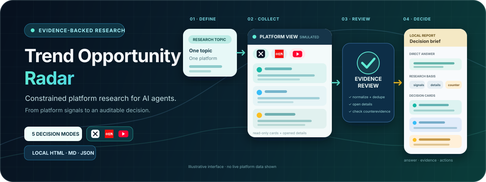
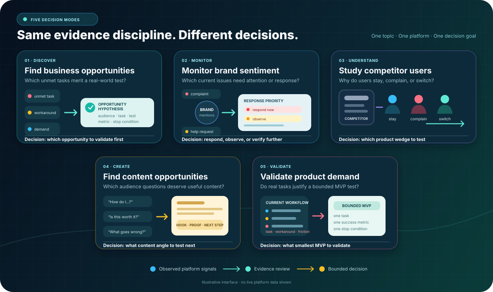

<p align="center">
  
</p>

<h1 align="center">Trend Opportunity Radar</h1>

<p align="center">
  Turn platform signals into auditable business, brand, competitor-user, content, and product-demand decisions.
</p>

<p align="center">
  <a href="https://github.com/datou202307-design/trend-opportunity-radar/releases"></a>
  
  
  
  <a href="LICENSE"></a>
  <a href="https://github.com/datou202307-design/trend-opportunity-radar/stargazers"></a>
</p>

<p align="center">
  <strong>English</strong> · <a href="README.zh-CN.md">简体中文</a>
</p>

An independent, brand-neutral agent Skill for analyzing evidence-backed trend opportunities for a research topic on one platform.

Current status: **v0.10.0 candidate**. This is a constrained platform-research workflow, not a viral-content, traffic, demand, or revenue prediction system. The candidate supports five decision profiles on X, Xiaohongshu, YouTube, Reddit, and validated Instagram hashtag topic research, plus an explicitly enabled TikTok topic-research Beta and an isolated Instagram account-research pilot. Reddit live research requires a user-connected third-party MCP service and keeps comments disabled. Optional OpenCLI read-only collection and DokoBot rendered-page verification or fallback are used only where the current environment passes capability checks.

## What it does

- Accepts a product, business opportunity, idea, user problem, audience need, or project as the research topic.
- Supports five decision goals: business opportunities, brand sentiment, competitor users, content opportunities, and product-demand validation.
- Compiles a short natural-language request into a versioned research context, so users do not need to specify internal evidence roles or sampling gates.
- Analyzes one platform at a time, including X, Xiaohongshu, YouTube, Reddit, explicitly enabled TikTok Beta, and adapter-defined platforms.
- Imports user-provided data or collects authorized, read-only browser and API signals.
- Normalizes evidence, source links, capture times, metrics, and limitations.
- Uses explicit quick, standard, and deep sampling contracts with a collection ledger.
- Atomically persists each completed query into one canonical raw snapshot.
- Orchestrates adapter-neutral query progression, raw-output retention, bounded recovery, and sampling gates.
- Distinguishes successful reads, timeouts, continuation availability, and explicit result exhaustion; first-screen completion or a timed-out read can no longer finalize a query as exhausted.
- Captures DokoBot's console-only session metadata through a deterministic wrapper, preserves immutable per-capture audit files, and restarts an expired continuation once before marking a query partial.
- Diagnoses missing, sandbox-hidden, permission-denied, broken, or browser-disconnected DokoBot environments before collection.
- Separates observed heat from evidence confidence without hiding missing data.
- Downgrades unopened browser search cards and caps confidence for incomplete collection.
- Deduplicates the same platform content across search-card and detail captures while preserving query and source provenance.
- Enforces per-layer observed, unique, detail, semantic-relevance, and subject-bridge evidence gates.
- Requires an explicit, auditable semantic clustering plan before clustered topics can become review-ready.
- Finalizes zero-result queries as auditable ledger entries and refuses to render reports from in-progress collection state.
- Requests short, non-duplicative recovery queries across as many deficient layers as the remaining collection budget permits.
- Excludes failed clusters and duplicate same-topic opportunity cards instead of padding the report to a visual quota.
- Keeps raw audit states in JSON while rendering incomplete evidence as localized research-status guidance rather than a software error.
- Condenses per-signal limitation notes into no more than four decision-impact summaries in human-facing reports while preserving the complete audit list in JSON.
- Recommends an optional, portable follow-up monitoring task so single snapshots can become comparable time series without overwriting history or pretending an automation was created.
- Preserves every repeated raw capture as a separate attempt file instead of overwriting earlier evidence.
- Adapts report language and decision framing to the user's request, research goal, and audience, and pairs every visible evidence gap with current value, boundaries, and a concrete resolution path.
- Backfills eligible retained detail links before reporting, without spending search-query budget, and keeps recoverable internal sampling gates out of human-facing reports.
- Applies a general-audience title readability gate, preserving the audit title while replacing unexplained product jargon with concrete reader-facing language.
- Generates topic-to-subject opportunities, counterevidence, risks, validation actions, and recollection tasks.
- Separates platform facts, user premises, model inferences, and human confirmation.
- Produces a self-contained local HTML report, concise Markdown, and machine-readable JSON.
- Rejects likely encoding corruption and verifies that HTML, Markdown, and JSON were generated from one mutually consistent UTF-8 result.
- For video-first feeds, discovers candidates from search cards and optionally extracts native captions, local speech transcripts, key frames, and OCR from no more than 10 deduplicated representative videos; media segments never increase trend sample counts.

## Five decision modes, shown as real research tasks

The evidence workflow stays stable while the decision question, evidence roles, and final action change with the user's goal.

<p align="center">
  
</p>

## Minimum input

Only two inputs are required:

1. A comprehensible research topic.
2. One target platform.

Example prompt:

```text
Use $trend-opportunity-radar to analyze the trend opportunities for an AI assistant that fills last-minute restaurant tables on X.
```

Chinese invocation:

```text
分析研究主题在某平台的趋势机会。
```

The agent should infer safe defaults for language, region, audience, query terms, time window, source mode, and collection mode. Standard research targets 60–100 observed result cards, 30–50 unique retained signals, 12–18 opened details, and at least three counter signals. Targets guide reproducibility and must never be filled with weak evidence.

## Install

Copy the Skill directory into your agent's Skill directory:

```text
skills/trend-opportunity-radar/
```

For Codex, place `trend-opportunity-radar` under `$CODEX_HOME/skills/` and restart or reload the agent session. Other agents may adapt `SKILL.md`, the reference contracts, and the Python scripts to their Skill or tool format.

The bundled scripts use the Python standard library. Python 3.10 or later is recommended.

## Data access

No live-data connector is required. The workflow supports:

- user-uploaded JSON or CSV;
- public web signals;
- controlled, read-only browser capture;
- authorized platform APIs;
- historical snapshots.

Chrome, OpenCLI, DokoBot, or an equivalent controlled browser is optional. The adapter selector uses only validated read-only capabilities and blocks rather than silently downgrading an undersized run. Users are responsible for platform terms, account permissions, and lawful data access. Credentials, cookies, and tokens must never be included in Skill inputs or outputs.

On YouTube, the validated path covers bounded search, video-detail enrichment, and separately requested bounded comments. Comment reads are capped at 10 representative items per eligible video, and transcripts are opened only when needed to verify a claim. Platform support does not guarantee that comments, transcripts, or a current browser session are available; every run must pass its own read-only capability probe.

On Reddit, the validated path uses a user-connected third-party MCP service for bounded community discovery and sequential topic search, then opens selected public permalinks for audited detail verification. Only `discover_subreddits`, `search_subreddit`, and `fetch_posts` are allowed. Comment-tree and Feed operations remain disabled; the service receives the research queries and subreddit names, and fewer results than requested never prove that Reddit has been exhausted.

### Optional video-evidence runtime

Video-first feeds such as TikTok can use the experimental `video-evidence-contract-v0.1`. Discovery adapters find and deduplicate candidates; a separate media layer handles native subtitles, local ASR, key frames, and on-screen OCR. Every channel preserves its provenance, so machine transcription and OCR are never rewritten as platform facts.

TikTok topic-research Beta is available only when explicitly enabled in a user-authorized, already logged-in Chrome session. OpenCLI performs bounded topic search while a separately preflighted DokoBot browser session enriches selected details. If the exact target is verified but DokoBot exposes no comment bodies, the bundled two-stage recorder freezes one target before an available Chrome-control adapter expands its Comments entry once. It then rejects request, content-ID, author, limit, or no-write mismatches before merging at most five visible top-level comments. The displayed comment count remains separate from captured text. Comment enrichment is optional and never blocks an otherwise complete search/detail report.

Instagram has two separate routes. Validated topic research uses one frozen hashtag in each standard query layer, performs two paced reads per hashtag, retains at most 24 canonical links per pass, opens at most 6 details sequentially, merges and deduplicates the three snapshots, and reviews retained posts plus any captured comments before reporting. Known-account research remains a pilot and can retain at most 12 recent canonical links, open at most 6 details, and keep at most 5 visible top-level comments per detail. The platform-displayed hashtag post count is preserved only as a supply-volume hint, never as observed sample size or search demand. Account search, personalized Explore, the generic Reels feed, Followers, and Following are never treated as topic or audience evidence. Both routes reject request, identity, limit, credential, follow-graph, or no-write mismatches and never package the browser session.

The reference runner can use pinned [mcp-video-analyzer](https://github.com/guimatheus92/mcp-video-analyzer), [yt-dlp](https://github.com/yt-dlp/yt-dlp), and optional local [whisper-ctranslate2](https://github.com/Softcatala/whisper-ctranslate2). None is bundled. Run `scripts/check_video_evidence_runtime.py` first; on Windows, prefer an isolated pinned local entry instead of reinstalling the package through `npx` for every video.

The Beta accepts only public or explicitly authorized individual video URLs, keeps concurrency at one, removes temporary frames, retains no full media, and does not forward cookies, browser sessions, cloud speech API keys, or Hugging Face tokens. Anonymous TikTok live research is not supported; structured import remains the session-independent fallback. Douyin media analysis is not claimed until it passes separate real acceptance.

Usable media text is reviewed by the Agent before it can appear in a report. The visible HTML/Markdown shows only a few exact reviewed excerpts under clear subtitle, machine-transcribed speech, or on-screen-text labels; raw ASR/OCR remains in JSON audit data. Users do not need to label the media manually.

## Important boundaries

- Do not mix heat scores from different platforms.
- Label browser-derived X data as controlled capture, not API data.
- Use `signal snapshot` when comparable time-series evidence is absent.
- Do not mark an opportunity `review_ready` when its sampling contract is incomplete.
- Do not treat global sample totals as sufficient when any query layer fails its quality gates.
- Do not interpret evidence confidence as business attractiveness or infer trend direction from one snapshot.
- Do not maintain a second hand-edited collection ledger beside `raw-signals.json`.
- Treat products as fact-bound subjects and ideas or opportunities as hypotheses.
- Only a human may promote `review_ready` evidence to `confirmed`.
- Do not claim that the evidence heat index predicts future virality, traffic, demand, or revenue.

## Third-party compatibility

DokoBot, OpenCLI, Chrome, mcp-video-analyzer, yt-dlp, whisper-ctranslate2, X, Xiaohongshu, YouTube, TikTok, and Instagram are optional third-party tools or platforms and are not bundled with this repository. Their names identify compatibility or experimental targets only; no affiliation, endorsement, account access, or permission is implied. Use each integration only with lawful access and in accordance with its applicable terms.

## Repository layout

```text
skills/trend-opportunity-radar/
├── SKILL.md
├── agents/openai.yaml
├── scripts/
├── references/
└── tests/
```

## License

MIT License. See [LICENSE](LICENSE).

## Release safety

This repository contains synthetic fixtures only. It does not package captured platform data, browser sessions, credentials, customer material, internal brands, or machine-specific run artifacts. Before publishing a change, run:

```text
python tools/audit_open_source_release.py
python tools/validate_skill.py skills/trend-opportunity-radar
python -m unittest discover -s skills/trend-opportunity-radar/tests -v
```
