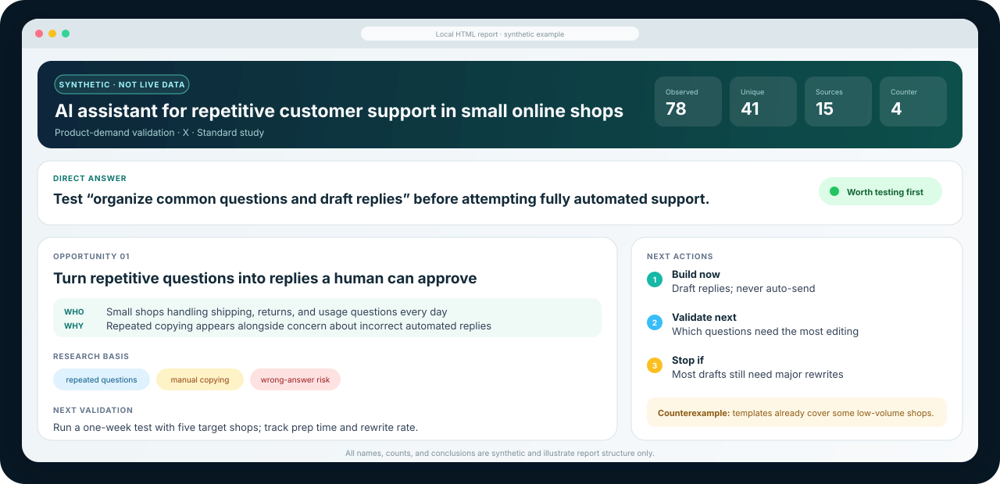

<p align="center">
  
</p>

<h1 align="center">Trend Opportunity Radar</h1>

<p align="center">
  Research one topic on one platform, then turn public signals into reviewable evidence and a clear next action.
</p>

<p align="center">
  <a href="https://github.com/datou202307-design/trend-opportunity-radar/releases"></a>
  
  
  
  <a href="LICENSE"></a>
  <a href="https://github.com/datou202307-design/trend-opportunity-radar/stargazers"></a>
</p>

<p align="center">
  <strong>English</strong> · <a href="README.zh-CN.md">简体中文</a>
</p>

Trend Opportunity Radar is an independent, brand-neutral Agent Skill. Give it a research topic and one platform; the Agent collects or imports signals, opens original sources, checks counterexamples, and generates a local report. The subject can be a product, business opportunity, idea, user problem, audience need, or project.

Current release: **v0.12.0 candidate**. It supports evidence-backed next-step decisions; it does not predict virality, traffic, demand, or revenue. Compatible monitoring is a candidate workflow: synthetic replay and responsive-report QA have passed, while the first real three-day forward comparison remains pending.

## Start in 30 seconds

You only need two inputs:

1. What you want to research.
2. Which platform to research.

```text
Use $trend-opportunity-radar to validate product demand for “an AI assistant that reduces repetitive support replies for small online shops” on X.
```

If the decision goal is not explicit, the Agent infers it from the request and asks only when a different choice would materially change the result. A standard study targets 60–100 observed result cards, 30–50 unique retained signals, 12–18 opened sources, and at least three counterexamples. Weakly related content never fills a quota.

## Five research scenarios

The evidence workflow stays stable while the business question and final action change with your goal.

<p align="center">
  
</p>

| Your goal | Question answered | Main output |
|---|---|---|
| Find business opportunities | Which unsolved problems are worth testing? | A prioritized opportunity |
| Monitor brand sentiment | What are people praising, questioning, or asking for help with? | Issues that need a response |
| Study competitor users | Why do users stay, complain, or switch? | User problems worth targeting |
| Find content opportunities | What do people keep asking, and what should you cover next? | Content angles worth testing |
| Validate product demand | Do users need it, and what is the smallest useful test? | A minimum demand test |

## See the result before you run it

The report leads with a direct answer, then shows collection counts, findings, opened sources, counterexamples, and next validation actions. The preview below uses synthetic data and does not represent a live platform conclusion.

<p align="center">
  
</p>

Each study generates:

- `trend-report.html` — a self-contained local page for reading and sharing;
- `trend-report.md` — a concise document for editing or handing to another Agent;
- `opportunities.json` — complete evidence, scoring, and audit fields.

## Platform support

| Platform or source | Current status | Research surface | Per-run requirement |
|---|---|---|---|
| X | Validated | Search results, original posts, visible engagement | Current read-only capability check passes |
| Xiaohongshu | Validated | Search cards, content details, visible engagement | Authorized browser or structured import |
| YouTube | Validated | Search, video details, bounded comments, captions when needed | Public content; comments and captions as available |
| Reddit | Validated | Community discovery, post search, detail verification | User-connected third-party MCP; comment trees disabled |
| Instagram | Hashtag topic research validated | Hashtag posts, details, bounded visible comments | Authorized, signed-in browser session |
| Facebook | Posts topic-research Beta | Public Posts search, verified details, bounded visible comments | Explicitly enabled, authorized signed-in browser session |
| TikTok | Topic-research Beta | Topic search, video details, bounded comment enrichment | Explicitly enabled, signed-in Chrome session |
| JSON / CSV | General import | User-provided structured signals | No live connector required |

Instagram known-account research remains a separate pilot and is not part of the validated topic route. Anonymous TikTok live research is unsupported, and Douyin has not passed separate real acceptance. Every run probes the actual capability it will use; an installed tool or an apparently signed-in browser never proves that the target platform is available.

## How it works

1. **Define the question** — compile natural language into one topic, one platform, and one business question.
2. **Collect signals** — read public or authorized content and retain source, time, engagement, and collection provenance.
3. **Check evidence** — deduplicate, open sources, review relevance, inspect counterexamples, and surface gaps.
4. **Recommend action** — state what the current evidence supports, why, and what to validate next.

Observed heat and evidence confidence remain separate. High-engagement search cards do not become conclusions automatically. Captions, machine transcripts, and OCR remain labeled by source and are never rewritten as platform facts.

## Install

Copy the Skill directory into your Agent's Skill directory:

```text
skills/trend-opportunity-radar/
```

For Codex, place `trend-opportunity-radar` under `$CODEX_HOME/skills/` and reload the Agent session. Other agents can adapt `SKILL.md`, the reference contracts, and the Python scripts. Bundled scripts use the Python standard library; Python 3.10 or later is recommended.

The optional deterministic entry point freezes the request and reports exactly one next action:

```bash
python skills/trend-opportunity-radar/scripts/trend_radar.py start \
  --prompt "Analyze AI travel planning on X for content opportunities." \
  --output-dir ./trend-research/ai-travel-x

python skills/trend-opportunity-radar/scripts/trend_radar.py doctor \
  --platform x

python skills/trend-opportunity-radar/scripts/trend_radar.py resume \
  --run-dir ./trend-research/ai-travel-x
```

`doctor` does not install tools or change login state. A live route becomes ready only after the platform's actual read-only preflight succeeds; structured import remains available when it does not. Call `resume` after every stage; it automatically runs safe deterministic steps, records immutable stage receipts, and stops at live, judgment, or visual-inspection boundaries. The run is deliverable only when its manifest reaches `complete`.

For repeated research, freeze a completed run as a compatible monitoring baseline, append each newer completed snapshot, then generate a three-format time comparison:

```bash
python skills/trend-opportunity-radar/scripts/trend_radar.py monitor create --run-dir ./run-1 --monitor-dir ./monitor
python skills/trend-opportunity-radar/scripts/trend_radar.py monitor append --monitor-dir ./monitor --run-dir ./run-2
python skills/trend-opportunity-radar/scripts/trend_radar.py monitor compare --monitor-dir ./monitor
```

Monitoring defaults to four snapshots (every three days for X/TikTok, weekly elsewhere). The command records state and cadence but never claims or creates an external schedule without explicit user confirmation. Snapshot movement describes visible signal differences, not demand growth or future performance.

## Data access and privacy

The Skill can use uploaded JSON/CSV, public web content, a controlled read-only browser, an authorized API, or historical snapshots. Chrome, OpenCLI, DokoBot, and third-party MCP services are optional adapters and are not bundled.

- Read only public or explicitly authorized data.
- Never package cookies, tokens, browser sessions, or customer data.
- Keep browser collection paced and sequential.
- Stop at CAPTCHAs, rate limits, or access controls instead of bypassing them.
- Fall back to structured import when a validated adapter is unavailable.

Users remain responsible for platform terms, account permissions, and applicable law.

## What it does not claim

- A single snapshot does not prove that a trend is rising or falling.
- Engagement does not equal demand, revenue, or commercial attractiveness.
- Heat scores from different platforms are never combined.
- Search cards, machine transcripts, and model inferences are not platform facts.
- Incomplete sampling is never padded with weakly related content.
- The evidence index does not predict future virality, traffic, demand, or revenue.

## Method and adapter documentation

- [Sampling contract](skills/trend-opportunity-radar/references/sampling-contract.md)
- [Unified execution entry point](skills/trend-opportunity-radar/references/execution-cli.md)
- [Scoring contract](skills/trend-opportunity-radar/references/scoring-contract.md)
- [Platform adapters](skills/trend-opportunity-radar/references/platform-adapters.md)
- [Browser collection](skills/trend-opportunity-radar/references/browser-collection.md)
- [Video evidence](skills/trend-opportunity-radar/references/video-evidence-contract.md)
- [Output schema](skills/trend-opportunity-radar/references/output-schema.md)

## Third-party compatibility

DokoBot, OpenCLI, Chrome, mcp-video-analyzer, yt-dlp, whisper-ctranslate2, X, Xiaohongshu, YouTube, Reddit, TikTok, Instagram, and Facebook are optional third-party tools or platforms. Names indicate compatibility or research targets only and do not imply affiliation, endorsement, account access, or authorization.

## Repository layout

```text
skills/trend-opportunity-radar/
├── SKILL.md
├── agents/openai.yaml
├── scripts/
├── references/
└── tests/
```

## Release safety

The repository contains synthetic fixtures and illustrative assets only. It does not package live platform captures, browser sessions, credentials, customer material, internal brands, or local run artifacts. Before release, run:

```text
python tools/audit_open_source_release.py
python tools/validate_skill.py skills/trend-opportunity-radar
python -m unittest discover -s skills/trend-opportunity-radar/tests -v
```

## License

MIT License. See [LICENSE](LICENSE).
