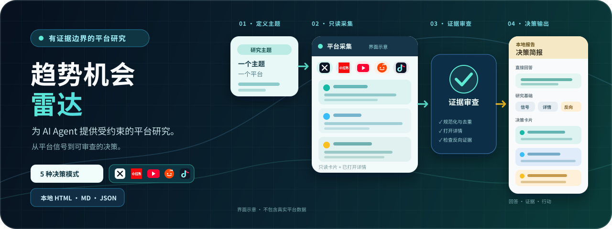
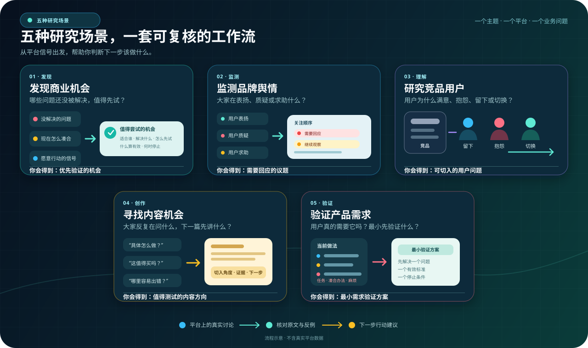
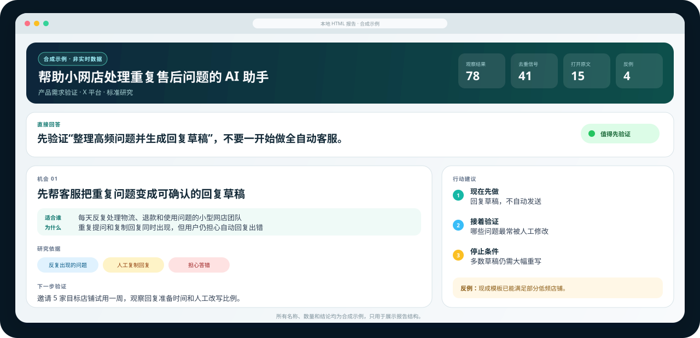

<p align="center">
  
</p>

<h1 align="center">Trend Opportunity Radar</h1>

<p align="center">
  围绕一个主题研究一个平台，把公开信号整理成可核对的依据和下一步行动建议。
</p>

<p align="center">
  <a href="https://github.com/datou202307-design/trend-opportunity-radar/releases"></a>
  
  
  
  <a href="LICENSE"></a>
  <a href="https://github.com/datou202307-design/trend-opportunity-radar/stargazers"></a>
</p>

<p align="center">
  <a href="README.md">English</a> · <strong>简体中文</strong>
</p>

这是一个独立、去品牌化的 Agent Skill。你提供研究主题和目标平台，Agent 负责采集或导入信号、打开原文、检查反例，并生成本地报告。它可以研究产品，也可以研究一个商机、想法、用户问题、受众需求或项目。

当前版本是 **v0.11.0 candidate**。它帮助你形成更有依据的下一步判断，不预测爆款、流量、需求或收入。

## 30 秒开始

只需要两个输入：

1. 你想研究什么。
2. 你想研究哪个平台。

```text
使用 $trend-opportunity-radar，分析“帮助小网店减少重复售后回复的 AI 助手”在 X 平台的产品需求。
```

如果没有指定研究目的，Agent 会结合你的问题推断；只有不同选择会明显改变结果时，才会请你确认。标准研究会尽量采集 60–100 条观察结果、保留 30–50 条去重信号、打开 12–18 条原文，并寻找至少 3 条反例。数据不足时不会用弱相关内容凑数。

## 五种研究场景

同一套证据工作流，可以根据你的目的回答五类不同问题。

<p align="center">
  
</p>

| 你想解决的问题 | 研究会回答什么 | 主要产出 |
|---|---|---|
| 发现商业机会 | 哪些问题还没被解决，值得先试？ | 优先验证的机会 |
| 监测品牌舆情 | 大家在表扬、质疑或求助什么？ | 需要回应的议题 |
| 研究竞品用户 | 用户为什么留下、抱怨或切换？ | 可切入的用户问题 |
| 寻找内容机会 | 大家反复在问什么，下一篇先讲什么？ | 值得测试的内容方向 |
| 验证产品需求 | 用户真的需要它吗？最小先验证什么？ | 最小需求验证方案 |

## 先看看最后会得到什么

报告先给出直接回答，再展示本次采集数量、主要发现、原文依据、反例和下一步验证动作。下面只使用合成数据展示结构，不代表任何真实平台结论。

<p align="center">
  
</p>

每次研究会生成：

- `trend-report.html`：适合直接阅读和分享的本地页面；
- `trend-report.md`：适合继续编辑或交给其他 Agent；
- `opportunities.json`：保留完整证据、评分和审计字段。

## 平台支持

| 平台或来源 | 当前状态 | 可以研究什么 | 本次运行要求 |
|---|---|---|---|
| X | 已验证 | 搜索结果、帖子原文和可见互动指标 | 通过本次只读能力检查 |
| 小红书 | 已验证 | 搜索卡片、内容详情和可见互动指标 | 已授权的浏览器或结构化导入 |
| YouTube | 已验证 | 搜索、视频详情、有限评论和按需字幕 | 公开内容；评论与字幕按可用性读取 |
| Reddit | 已验证 | 社区发现、帖子搜索和详情核对 | 用户连接第三方 MCP；评论树暂不读取 |
| Instagram | Hashtag 主题研究已验证 | Hashtag 内容、详情和有限可见评论 | 已登录且已授权的浏览器会话 |
| Facebook | Posts 主题研究 Beta | 公开 Posts 搜索、详情核对和有限可见评论 | 显式启用且已授权、已登录的浏览器会话 |
| TikTok | 主题研究 Beta | 主题搜索、视频详情和有限评论补充 | 显式启用且已登录的 Chrome 会话 |
| JSON / CSV | 通用导入 | 用户提供的结构化信号 | 不需要实时连接器 |

Instagram 已知账号研究仍是独立试点，不等于主题研究能力。TikTok 匿名实时研究不在支持范围内；抖音尚未通过独立真实验收。任何平台在每次运行时都要重新检查当前可用能力，不能仅凭已经安装工具或浏览器已经登录就假定可用。

## 它如何工作

1. **说清问题**：把自然语言请求整理为一个主题、一个平台和一个业务问题。
2. **采集信号**：读取公开或已授权内容，保存来源、时间、互动指标和采集记录。
3. **核对证据**：去重、打开原文、检查相关性、反例和数据缺口。
4. **给出建议**：输出当前可以判断什么、依据是什么，以及下一步验证什么。

观察热度和证据可靠性始终分开。搜索卡片不会因为互动高就自动成为结论；视频字幕、机器转写和 OCR 也会分别标明来源，不会改写成平台事实。

## 安装

把 Skill 目录复制到你的 Agent Skill 目录：

```text
skills/trend-opportunity-radar/
```

在 Codex 中，把 `trend-opportunity-radar` 放到 `$CODEX_HOME/skills/`，然后重新加载 Agent 会话。其他 Agent 可以适配 `SKILL.md`、参考契约和 Python 脚本。内置脚本只使用 Python 标准库，建议使用 Python 3.10 或更高版本。

## 数据访问与隐私

Skill 可以使用用户上传的 JSON/CSV、公开网页、受控只读浏览器、已授权 API 或历史快照。Chrome、OpenCLI、DokoBot 和第三方 MCP 都是可选适配器，不随仓库分发。

- 只读取公开或明确授权的数据；
- 不打包 Cookie、Token、浏览器会话或客户数据；
- 不并发执行高频浏览器操作；
- 遇到验证码、限流或访问控制时停止，而不是尝试绕过；
- 当前环境缺少适配器时，可以改用结构化数据导入。

用户需要自行遵守平台条款、账号权限和适用法律。

## 它不会声称什么

- 不把单次研究写成正在上升或下降的长期趋势；
- 不把互动量直接解释为需求、收入或商业吸引力；
- 不混合不同平台的热度评分；
- 不把搜索卡片、机器转写或模型推断伪装成平台事实；
- 不在采样不足时用低相关内容凑满报告；
- 不宣称能够预测未来爆款、流量、需求或收入。

## 方法和适配器文档

- [采样合同](skills/trend-opportunity-radar/references/sampling-contract.md)
- [评分合同](skills/trend-opportunity-radar/references/scoring-contract.md)
- [平台适配器](skills/trend-opportunity-radar/references/platform-adapters.md)
- [浏览器采集](skills/trend-opportunity-radar/references/browser-collection.md)
- [视频证据](skills/trend-opportunity-radar/references/video-evidence-contract.md)
- [输出结构](skills/trend-opportunity-radar/references/output-schema.md)

## 第三方兼容性

DokoBot、OpenCLI、Chrome、mcp-video-analyzer、yt-dlp、whisper-ctranslate2、X、小红书、YouTube、Reddit、TikTok、Instagram 和 Facebook 均为可选第三方工具或平台。名称仅用于说明兼容或研究目标，不代表关联、背书、账号访问或授权。

## 仓库结构

```text
skills/trend-opportunity-radar/
├── SKILL.md
├── agents/openai.yaml
├── scripts/
├── references/
└── tests/
```

## 发布安全

仓库只包含合成测试夹具和示意资产，不包含真实平台采集数据、浏览器会话、凭据、客户材料、内部品牌或本机运行产物。发布前运行：

```text
python tools/audit_open_source_release.py
python tools/validate_skill.py skills/trend-opportunity-radar
python -m unittest discover -s skills/trend-opportunity-radar/tests -v
```

## 许可证

MIT License，见 [LICENSE](LICENSE)。
